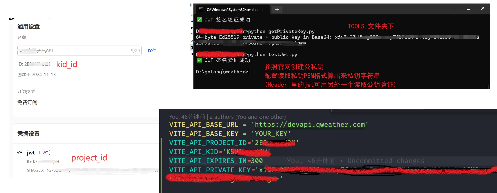
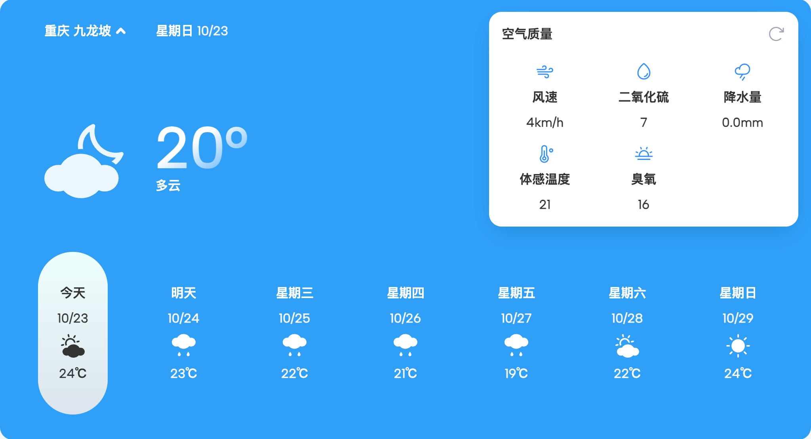
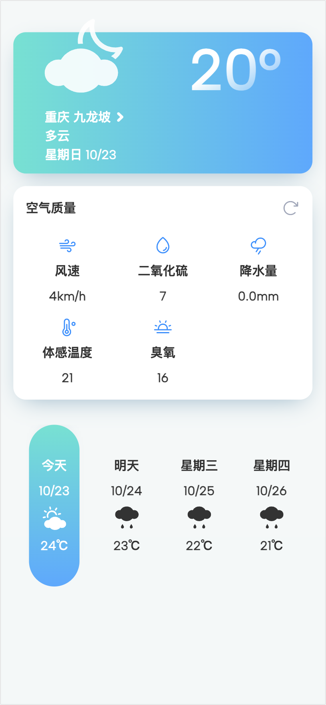

# Vue 3 + Vite +tailwindcss

这是项目所使用的技术栈，可以帮助快速构建响应式网站

# 关于api的调用

需要将两个.env文件的KEY换成你自己在和风天气创建的项目KEY，免费订阅、标准订阅都可以，标准订阅将可以请求紫外线及历史天气预报信息

也可以使用官方建议用使用 [JSON Web Token](https://dev.qweather.com/docs/authentication/jwt/) 整一个公私钥进行调用，这里为了调试方便使用了 tweetnacl 库从64字节的私钥字符串中直接加密生成 jwt，如何使用见下图。

`tools` 文件夹下是两个 python 工具私钥 PEM 转字符串格式 (`getPrivateKey.py`) 及测试 jwt (`testJwt.py`), 用之前 pip 安装下依赖 `pip install cryptography`，读取 PEM 后复制转后字符串填入前端的配置文件。

# 注意事项

官网建议项目 KEY 和公私钥等安全密钥最好是不要暴露在前端，而是在服务器去使用，所以用到真实项目时可能需要后端开发提供新的接口。

有些接口需要收费使用，见[官网](https://dev.qweather.com/docs/finance/subscription/)。

# 效果图

